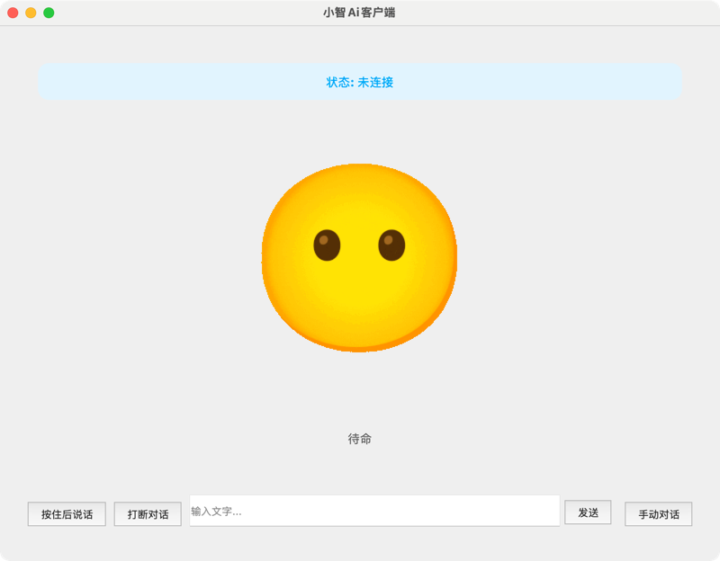

简体中文 | [English](README.en.md)

## 项目简介

py-xiaozhi 是一个使用 Python 实现的小智语音客户端，旨在通过代码学习和在没有硬件条件下体验 AI 小智的语音功能。
本仓库是基于[xiaozhi-esp32](https://github.com/78/xiaozhi-esp32)移植

## 演示

- [Bilibili 演示视频](https://www.bilibili.com/video/BV1HmPjeSED2/#reply255921347937)



## 功能特点

### 🎯 核心AI功能

- **AI语音交互**：支持语音输入与识别，实现智能人机交互，提供自然流畅的对话体验
- **视觉多模态**：支持图像识别和处理，提供多模态交互能力，理解图像内容
- **智能唤醒**：支持多种唤醒词激活交互，免去手动操作的烦恼（可配置开启）
- **自动对话模式**：实现连续对话体验，提升用户交互流畅度

### 🔧 MCP工具生态系统

- **系统控制工具**：系统状态监控、应用程序管理、音量控制、设备管理等
- **日程管理工具**：全功能日程管理，支持创建、查询、更新、删除事件，智能分类和提醒
- **定时任务工具**：倒计时器功能，支持延时执行MCP工具，多任务并行管理
- **音乐播放工具**：在线音乐搜索播放，支持播放控制、歌词显示、本地缓存管理
- **12306查询工具**：12306铁路票务查询，支持车票查询、中转查询、列车路线查询
- **搜索工具**：网络搜索和网页内容获取，支持必应搜索和智能内容解析
- **菜谱工具**：丰富菜谱库，支持菜谱搜索、分类查询、智能推荐
- **地图工具**：高德地图服务，支持地理编码、路径规划、周边搜索、天气查询
- **八字命理工具**：传统八字命理分析，支持八字计算、婚姻分析、黄历查询
- **摄像头工具**：图像捕获和AI分析，支持拍照识别和智能问答
- **🎯动作工具**：通过udp调用，可以配合青龙lite完成10种上肢动作|[新增功能](documents/docs/mcp/action/青龙lite语音控制文档.md)
- **🎯表情工具**：配合青龙lite切换表情|[新增功能](documents/docs/mcp/action/小智设备麦克风配置与问题解决说明文档.md)
- **🎯导航工具**：通过调用VLN大模型完成导航任务|[新增功能](documents/docs/mcp/navigation/demo.webm)
- **🎯知识库工具**：配合WeKnora搭建本地知识库 [新增功能](documents/docs/mcp/knowledgebase/小智知识库MCP说明文档.md)


## 系统要求

### 基础要求

- **Python版本**：3.9 - 3.12
- **操作系统**：Windows 10+、macOS 10.15+、Linux
- **音频设备**：麦克风和扬声器设备
- **网络连接**：稳定的互联网连接（用于AI服务和在线功能）

### 推荐配置

- **内存**：至少4GB RAM（推荐8GB+）
- **处理器**：支持AVX指令集的现代CPU
- **存储**：至少2GB可用磁盘空间（用于模型文件和缓存）
- **音频**：支持16kHz采样率的音频设备

### 可选功能要求

- **语音唤醒**：需要下载Sherpa-ONNX语音识别模型
- **摄像头功能**：需要摄像头设备和OpenCV支持

## 请先看这里

- 仔细阅读 [项目文档](https://huangjunsen0406.github.io/py-xiaozhi/) 启动教程和文件说明都在里面了
- main是最新代码，每次更新都需要手动重新安装一次pip依赖防止我新增依赖后你们本地没有

[从零开始使用小智客户端（视频教程）](https://www.bilibili.com/video/BV1dWQhYEEmq/?vd_source=2065ec11f7577e7107a55bbdc3d12fce)


## 开发指南

### 项目结构

```
py-xiaozhi/
├── main.py                     # 应用程序主入口（CLI参数处理）
├── src/
│   ├── application.py          # 应用程序核心逻辑
│   ├── audio_codecs/           # 音频编解码器
│   │   ├── aec_processor.py    # 音频回声消除处理器
│   │   ├── audio_codec.py      # 音频编解码基础类
│   │   └── system_audio_recorder.py  # 系统音频录制器
│   ├── audio_processing/       # 音频处理模块
│   │   ├── vad_detector.py     # 语音活动检测
│   │   └── wake_word_detect.py # 唤醒词检测
│   ├── core/                   # 核心组件
│   │   ├── ota.py             # 在线更新模块
│   │   └── system_initializer.py # 系统初始化器
│   ├── display/                # 显示界面抽象层
│   ├── iot/                    # IoT设备管理
│   │   ├── thing.py           # 设备基类
│   │   ├── thing_manager.py   # 设备管理器
│   │   └── things/            # 具体设备实现
│   ├── mcp/                    # MCP工具系统
│   │   ├── mcp_server.py      # MCP服务器
│   │   └── tools/             # 各种工具模块
│   ├── protocols/              # 通信协议
│   ├── utils/                  # 工具函数
│   └── views/                  # UI视图组件
├── libs/                       # 第三方原生库
│   ├── libopus/               # Opus音频编解码库
│   ├── webrtc_apm/            # WebRTC音频处理模块
│   └── SystemAudioRecorder/   # 系统音频录制工具
├── config/                     # 配置文件目录
├── models/                     # 语音模型文件
├── assets/                     # 静态资源文件
├── scripts/                    # 辅助脚本
├── requirements.txt            # Python依赖包列表
└── build.json                  # 构建配置文件
```

### 开发环境设置

```bash
# 克隆项目
git clone https://github.com/huangjunsen0406/py-xiaozhi.git
cd py-xiaozhi

# 安装依赖
pip install -r requirements.txt

# 代码格式化
./format_code.sh

# 运行程序 - GUI模式（默认）
python main.py

# 运行程序 - CLI模式
python main.py --mode cli

# 指定通信协议
python main.py --protocol websocket  # WebSocket（默认）
python main.py --protocol mqtt       # MQTT协议
```

### 核心开发模式

- **异步优先**: 使用`async/await`语法，避免阻塞操作
- **错误处理**: 完整的异常处理和日志记录
- **配置管理**: 使用`ConfigManager`统一配置访问
- **测试驱动**: 编写单元测试，确保代码质量

### 扩展开发

- **添加MCP工具**: 在`src/mcp/tools/`目录创建新工具模块
- **添加IoT设备**: 继承`Thing`基类实现新设备
- **添加协议**: 实现`Protocol`抽象基类
- **添加界面**: 扩展`BaseDisplay`实现新的UI组件

### 状态流转图

```
                        +----------------+
                        |                |
                        v                |
+------+  唤醒词/按钮  +------------+   |   +------------+
| IDLE | -----------> | CONNECTING | --+-> | LISTENING  |
+------+              +------------+       +------------+
   ^                                            |
   |                                            | 语音识别完成
   |          +------------+                    v
   +--------- |  SPEAKING  | <-----------------+
     完成播放 +------------+
```


## 许可证

[MIT License](LICENSE)
